# Final Project at EPAM

# Planning infrastructure
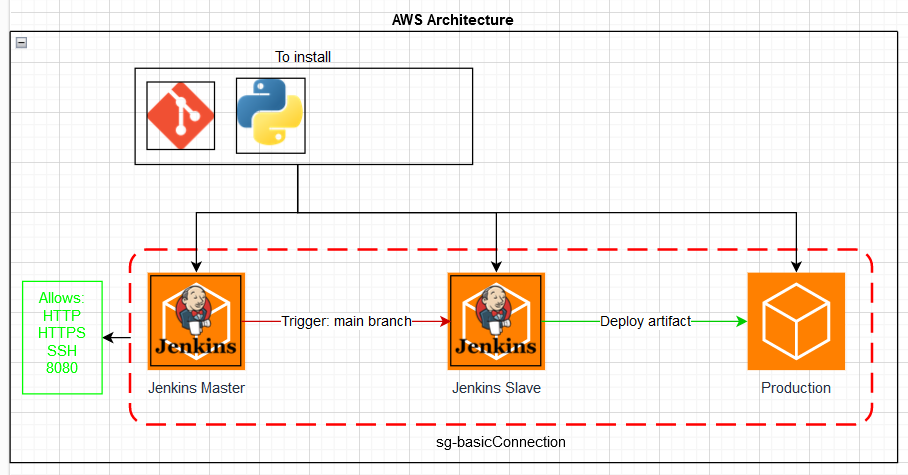
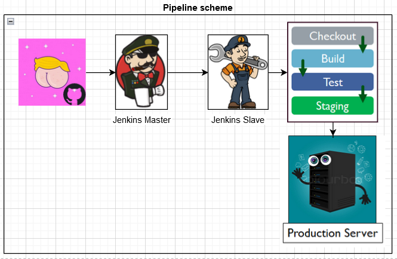
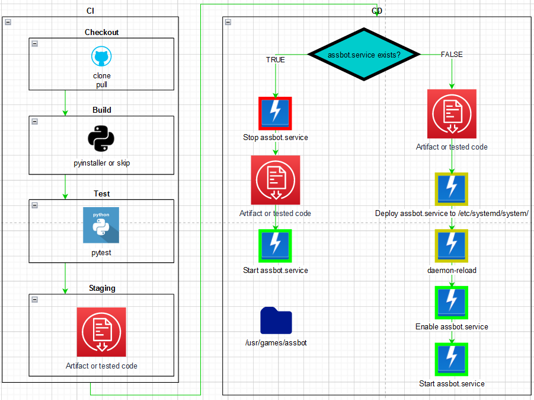
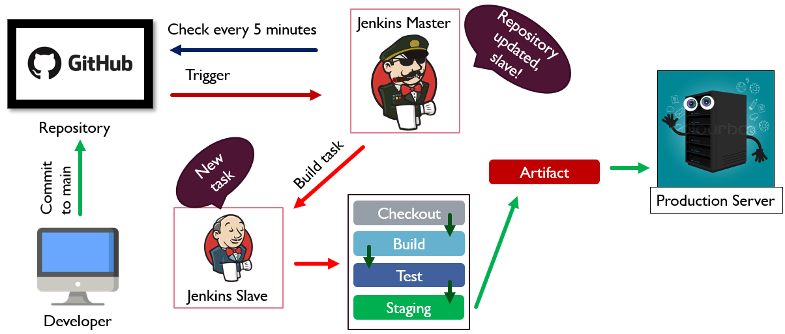

# Deploy inftrastructure (Terraform)
- [main.tf](https://github.com/fecton/competed_zadanija/blob/main/FINAL_PROJECT/code/1_Terraform/main.tf)
- [variables.tf](https://github.com/fecton/competed_zadanija/blob/main/FINAL_PROJECT/code/1_Terraform/variables.tf)

# Configuration Managment (Ansible)
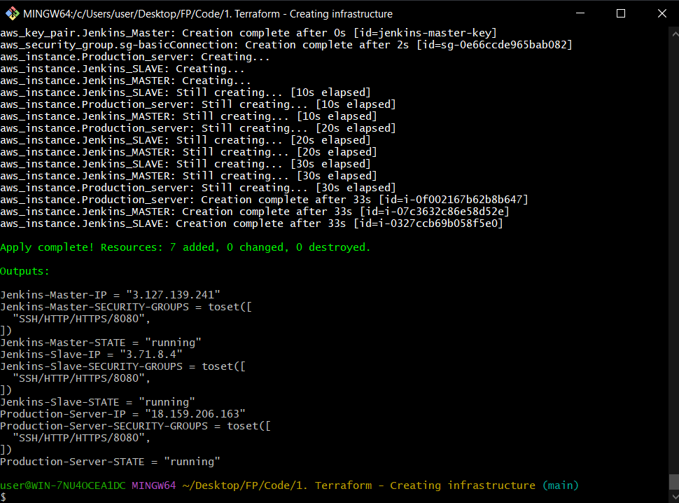
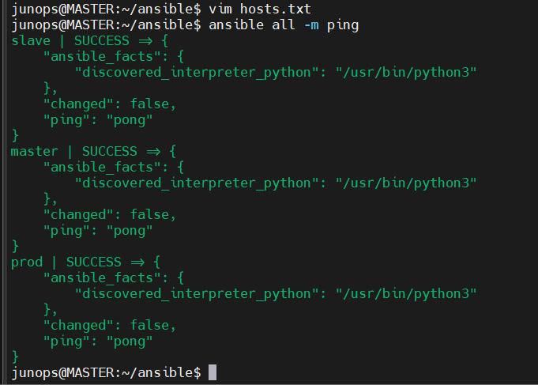
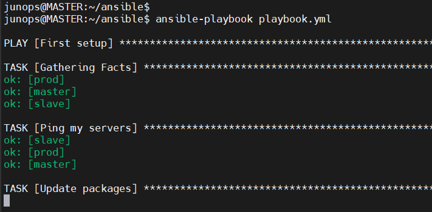

# CI/CD (Jenkins)
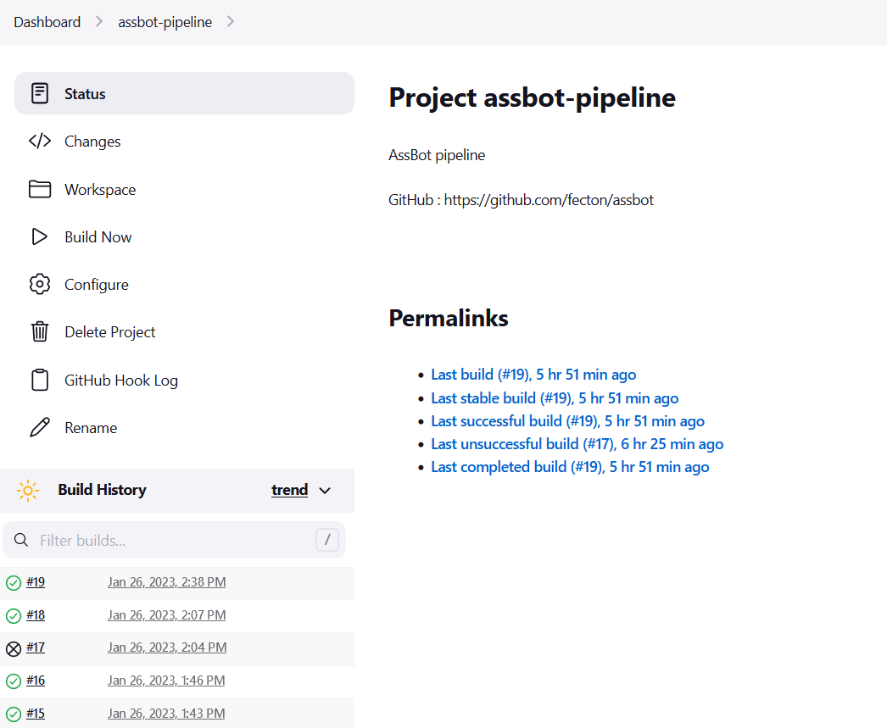
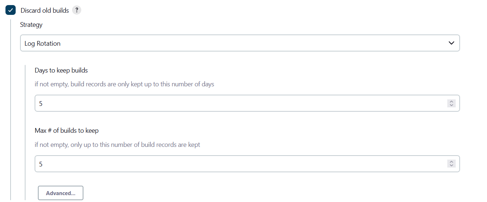
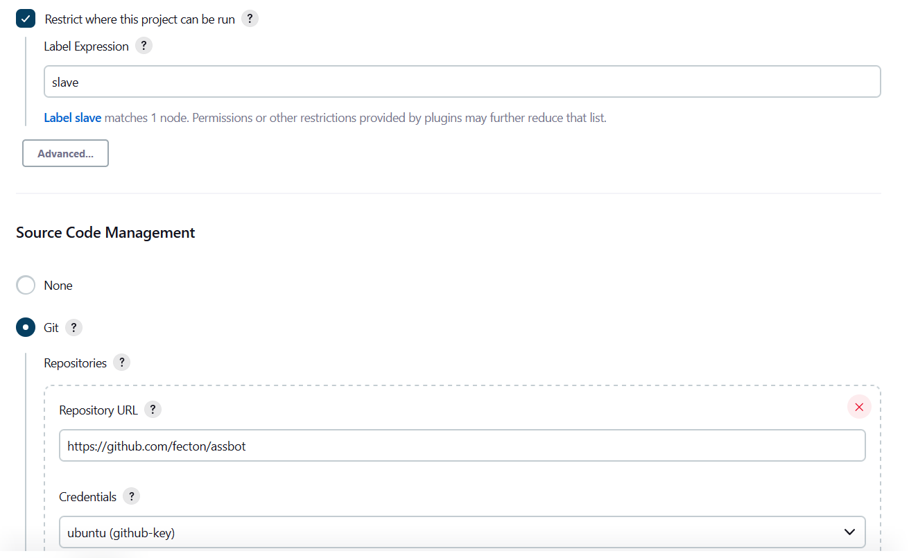
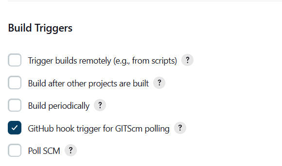
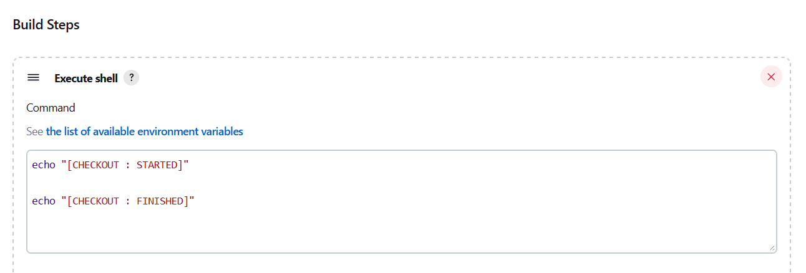
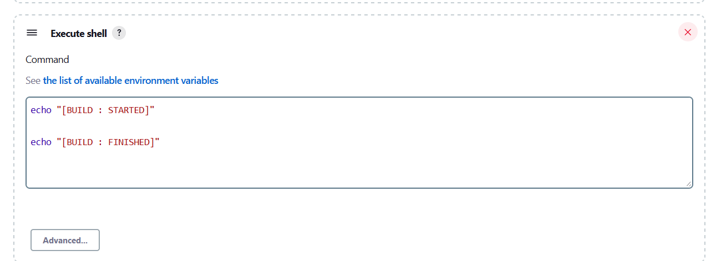
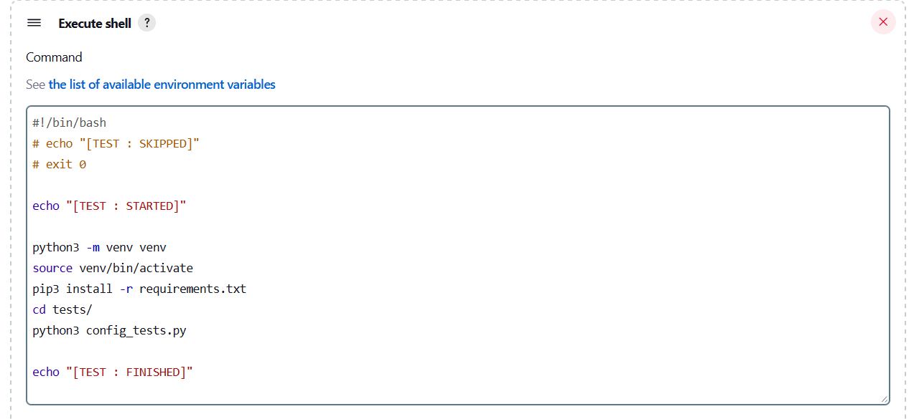
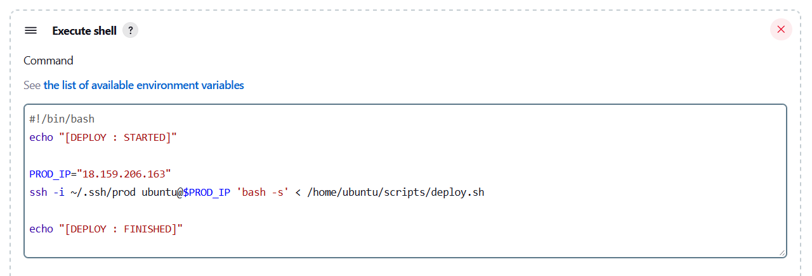
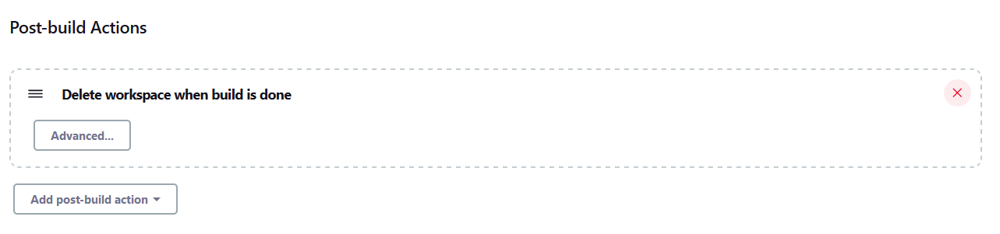
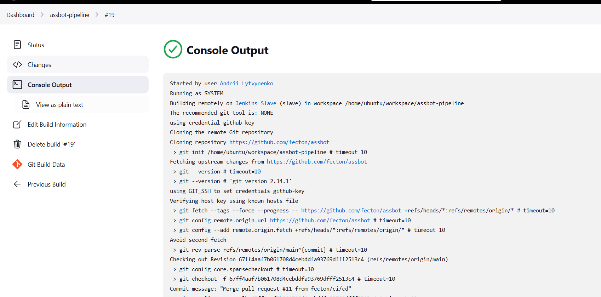
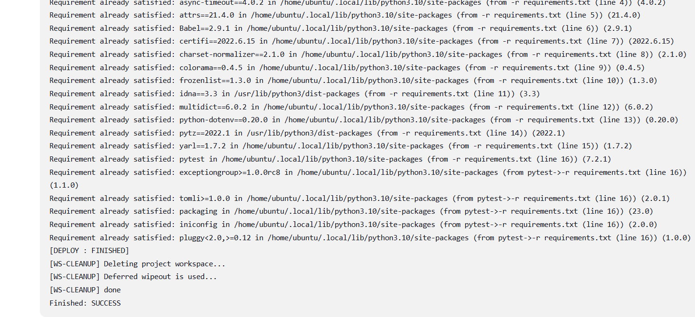

# Result
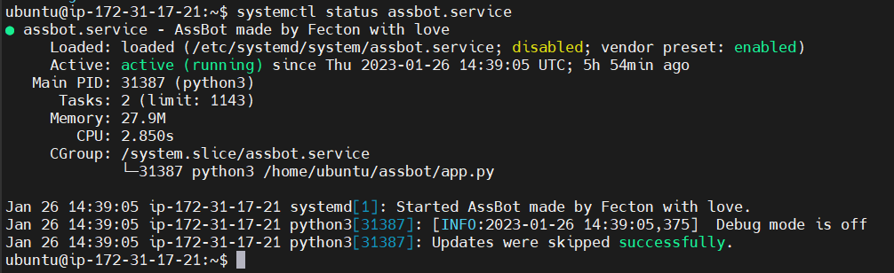
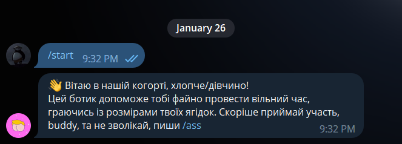

