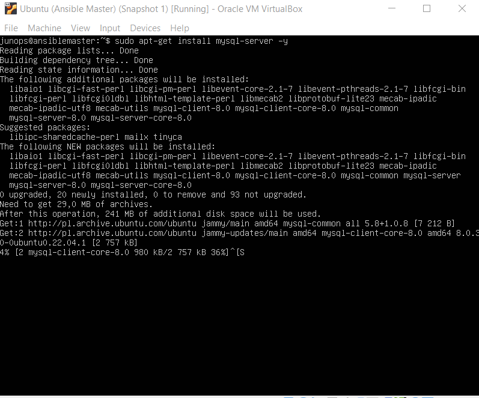
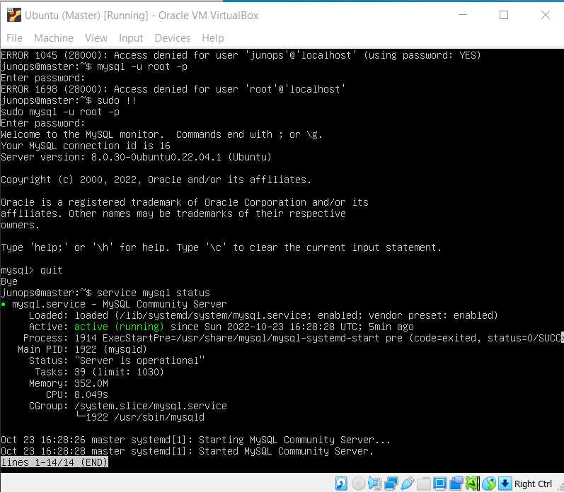
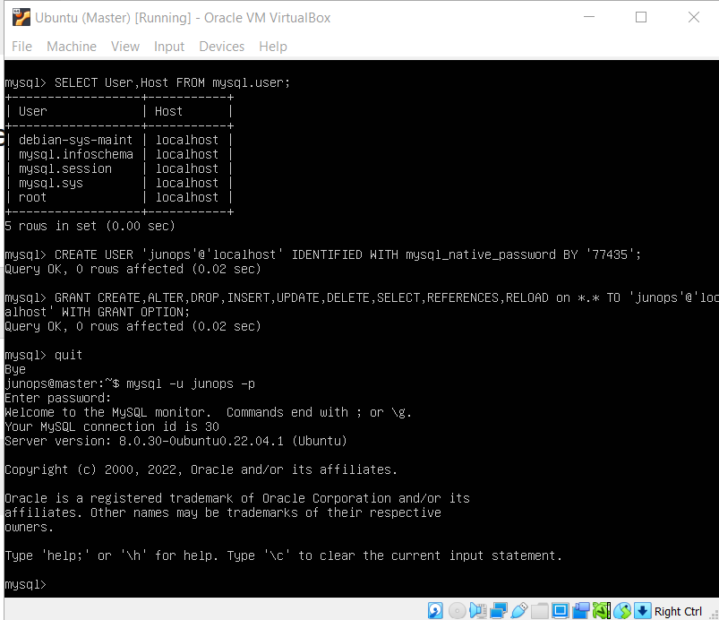
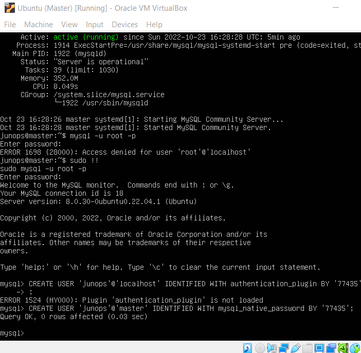
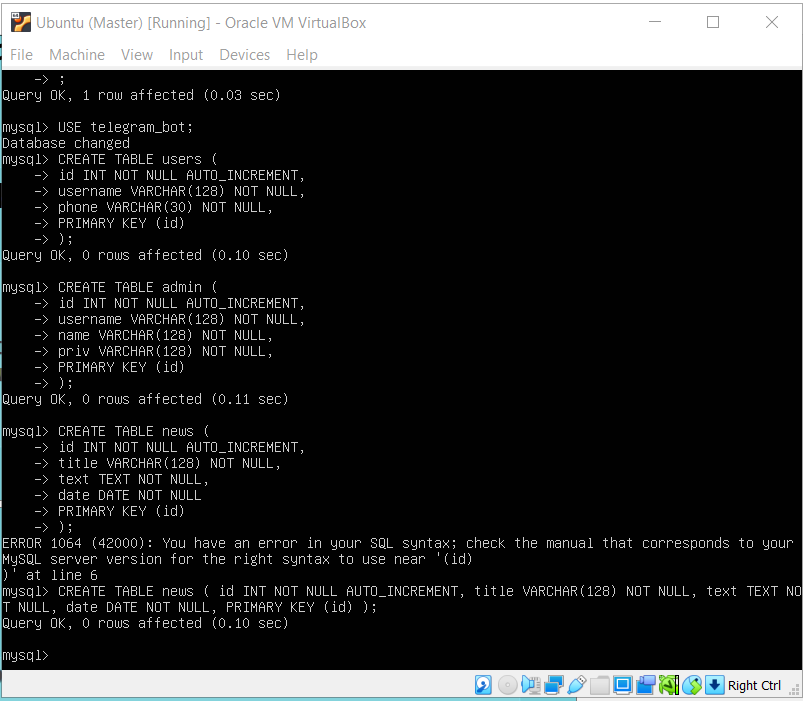

# Database Managment
# PART 1
## 1. Mysql installing
```
sudo apt-get install mysql-server -y
```



## 2. Mysql works properly
```
sudo service mysql status
mysql -u root -p

CREATE USER 'junops'@'localhost' IDENTIFIED WITH mysql_native_password BY '77435';

ALTER USER 'sammy'@'localhost' IDENTIFIED WITH
mysql_native_password BY 'password';

GRANT CREATE,ALTER,DROP,INSERT,UPDATE,DELETE,SELECT,REFERENCES,RELOAD on *.* TO 'junops'@'localhost' WITH GRANT OPTION;

FLUSH PRIVILEGES;
```





## 3/4. Creating 3 tables
```
CREATE TABLE users (
    id          INT NOT NULL AUTO_INCREMENT,
    username    VARCHAR(128) NOT NULL,
    phone       VARCHAR(30) NOT NULL,
    PRIMARY KEY (id)
);

CREATE TABLE admin (
    id          INT NOT NULL AUTO_INCREMENT,
    username    VARCHAR(128) NOT NULL,
    name        VARCHAR(128) NOT NULL,
    priv        VARCHAR(128) NOT NULL,
    PRIMARY KEY (id)
);

CREATE TABLE news (
    id      INT NOT NULL AUTO_INCREMENT,
    title   VARCHAR(128) NOT NULL,
    text    TEXT NOT NULL,
    date    DATE NOT NULL,
    PRIMARY KEY (id)
);
```


## 5. Filling the tables
```

```


## 6. Constructing and executing SELECT operator with WHERE, GROUP BY and ORDER BY
```

```


## 7. 
```

```


## 8. 
```

```
