# Database Managment
# PART 1
## 1. Mysql installing
```
sudo apt-get install mysql-server -y
```


## 2. Mysql works properly
```
sudo service mysql status
mysql -u root -p

CREATE USER 'junops'@'localhost' IDENTIFIED WITH mysql_native_password BY '77435';

ALTER USER 'sammy'@'localhost' IDENTIFIED WITH
mysql_native_password BY 'password';

GRANT CREATE,ALTER,DROP,INSERT,UPDATE,DELETE,SELECT,REFERENCES,RELOAD on *.* TO 'junops'@'localhost' WITH GRANT OPTION;

FLUSH PRIVILEGES;
```


## 3/4. Creating 3 tables
```
CREATE TABLE users (
    id          INT NOT NULL AUTO_INCREMENT,
    username    VARCHAR(128) NOT NULL,
    phone       VARCHAR(30) NOT NULL,
    PRIMARY KEY (id)
);

CREATE TABLE admin (
    id          INT NOT NULL AUTO_INCREMENT,
    username    VARCHAR(128) NOT NULL,
    name        VARCHAR(128) NOT NULL,
    priv        VARCHAR(128) NOT NULL,
    PRIMARY KEY (id)
);

CREATE TABLE news (
    id      INT NOT NULL AUTO_INCREMENT,
    title   VARCHAR(128) NOT NULL,
    text    TEXT NOT NULL,
    date    DATE NOT NULL,
    PRIMARY KEY (id)
);
```

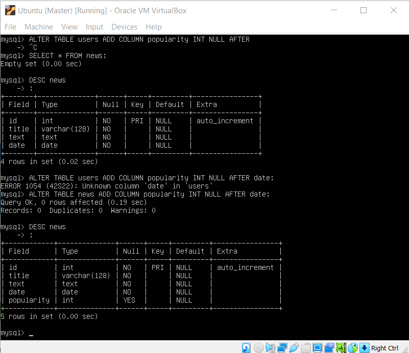

## 5. Filling the tables
```
INSERT INTO users (username, phone) VALUES (
    'Nastya', 
    '09324294902309'
);

INSERT INTO news (title,text,date,popularity) VALUES (
    'Python is relevant?', 
    'Yes, Python is always relevant :D', 
    '2021-7-12', 
    1000
);

INSERT INTO admin (username, name, priv) VALUES (
    'fecton',
    'Andrew',
    'I like kvas'
);
```
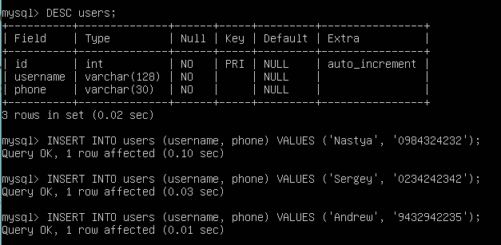
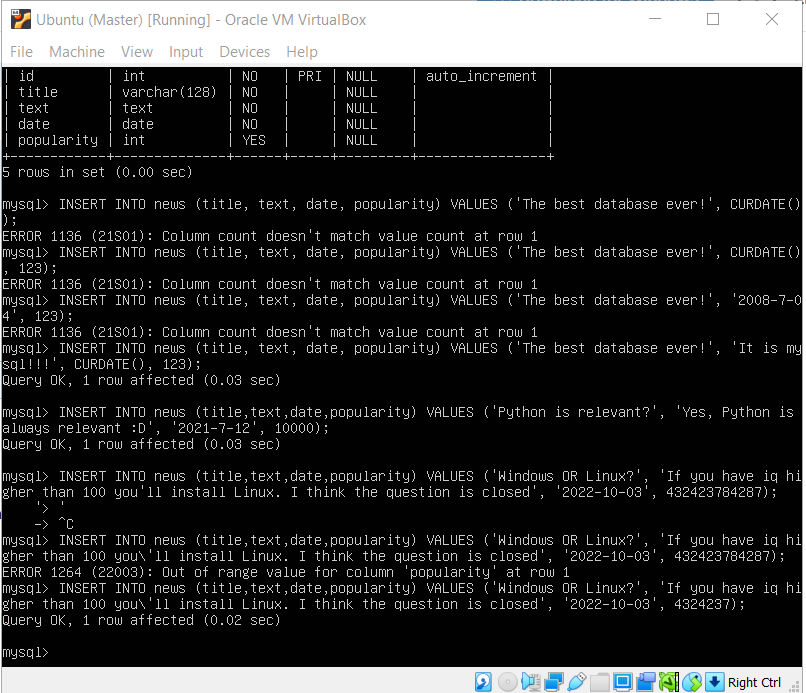
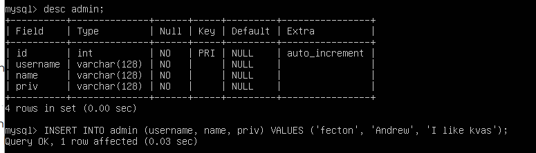

## 6. Constructing and executing SELECT operator with WHERE, GROUP BY and ORDER BY
```
SELECT COUNT(id),username,phone FROM users WHERE username='Nastya';

SELECT COUNT(id),username,phone FROM users GROUP BY username;

SELECT COUNT(id),username,phone FROM users GROUP BY username ORDER BY username;
```
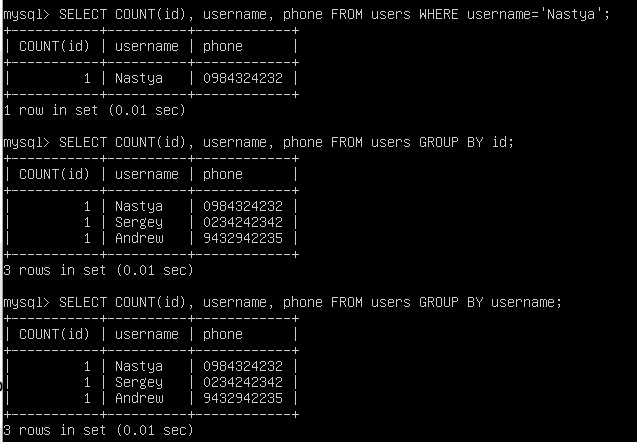
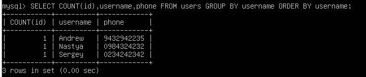

## 7. Execute other different SQL queries DDL, DML, DCL
- DDL - Data Defenition Language
- DML - Data Manipulation Language
- DCL - Data Control Language
```
UPDATE users SET username='Andrzej' WHERE username='Andrew';

DROP TABLE admin;
```
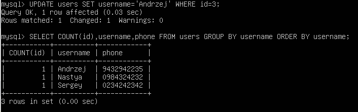
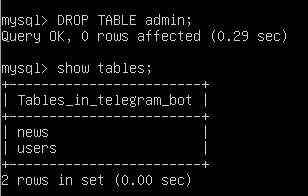

Grant I used in screenshots before

## 8. Create a database of new userrs with different privileges. Connect to the database as a new user and verify that the privileges allow or deny certain actions.
```
CREATE DATABASE priv_test;
USE priv_test;

CREATE USER 'view_only'@'localhost' IDENTIFIED WITH mysql_native_password BY '123';

CREATE USER 'editor'@'localhost' IDENTIFIED WITH mysql_native_password BY '123';

CREATEE TABLE books (
    id INT NOT NULL AUTO_INCREMENT,
    username VARCHAR(128) NOT NULL,
    book_name VARCHAR(128) NOT NULL,
    price INT NOT NULL,
    PRIMARY KEY(id)
);

GRANT SELECT ON priv_test.books TO 'view_only'@'localhost';

GRANT ALTER,INSERT,UPDATE,SELECT,DELETE ON priv_test.books TO 'editor'@'localhost';

FLUSH PRIVILEGES;
```
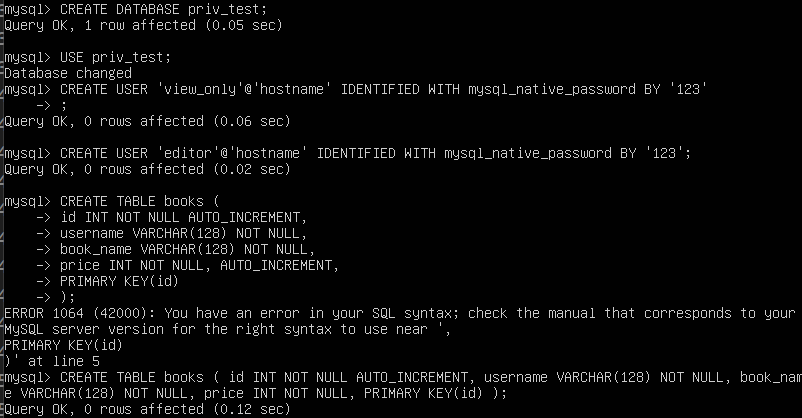
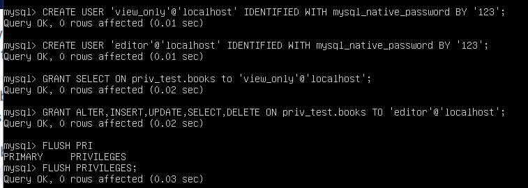
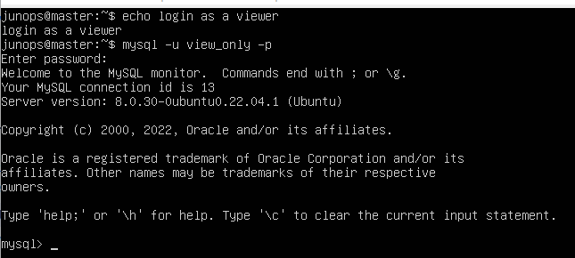
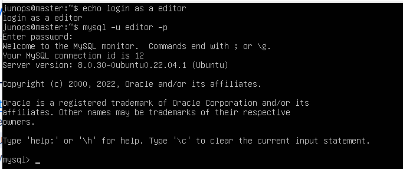
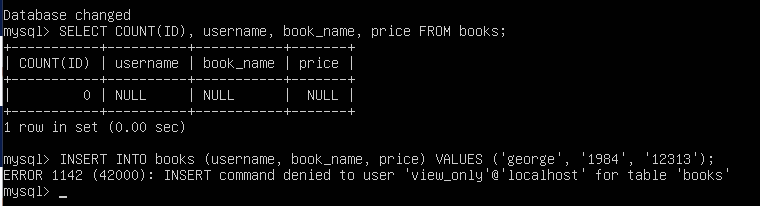
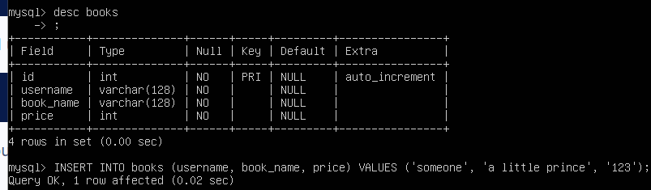

## 9. Make a selection from the main table DB MySQL
```
USE mysql;
SHOW TABLES;
SELECT * FROM db;
SELECT * FROM user;
```
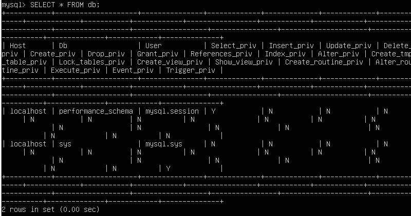

# PART 2
## 7. 
```

```


## 8. 
```

```


## 6. Constructing and executing SELECT operator with WHERE, GROUP BY and ORDER BY
```

```


## 7. 
```

```


## 8. 
```

```


## 6. Constructing and executing SELECT operator with WHERE, GROUP BY and ORDER BY
```

```


## 7. 
```

```


## 8. 
```

```
