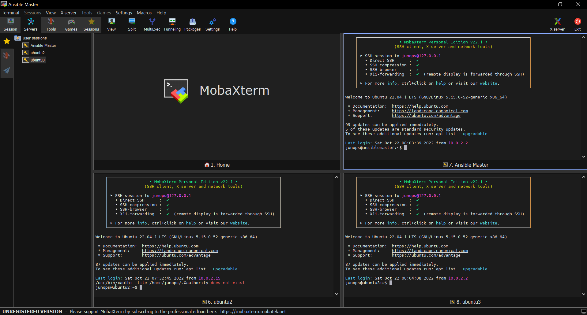

# EPAM University
## Ansible tasks and self-studing

### 1. Trying to connect but servers didn't have openssh-server

### 2. Openssh-servers work fine and ping was good

### 3. I decided to build NAT for my convenient

### 4. Now I could access an each server by MobaXterm

