# Lesson 7

### Trying to connect but servers didn't have openssh-server
```
ansible all -m ping
```
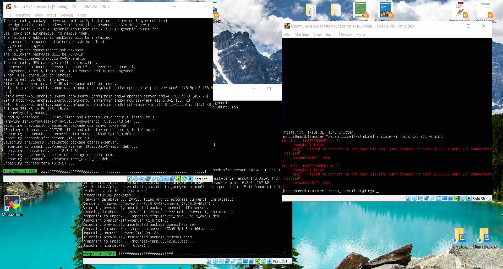

### I decided to build NAT for my convenient
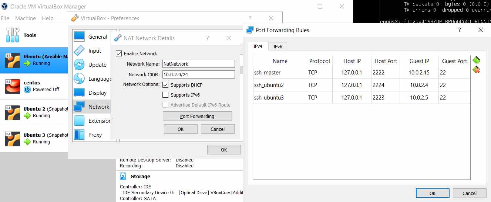

### Openssh-servers work fine and ping was good
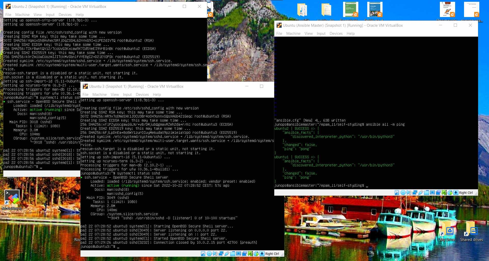

### Now I could access an each server by MobaXterm
```
ansible all -m ping
```
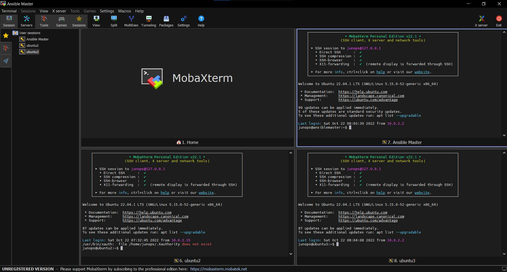

### Run a command in the linux environment
```
ansible all -m shell -a "uptime"
```
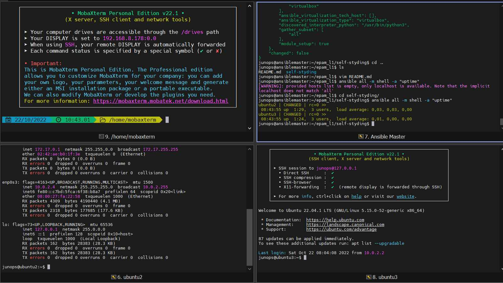

### Run a command
```
ansible all -m command -a "ls /"
```
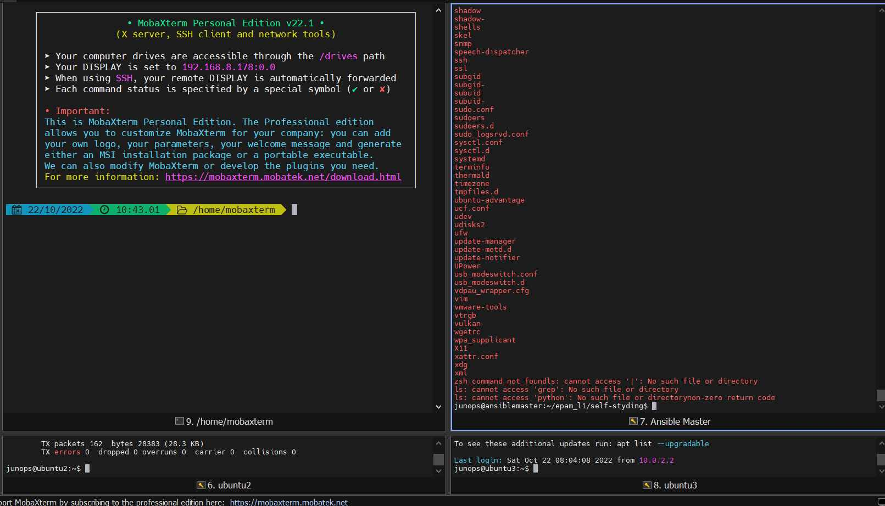

### Copy a file to servers
```
ansible all -m copy -a "scr=hi.txt dest=/home/junops mode=777" -b
```
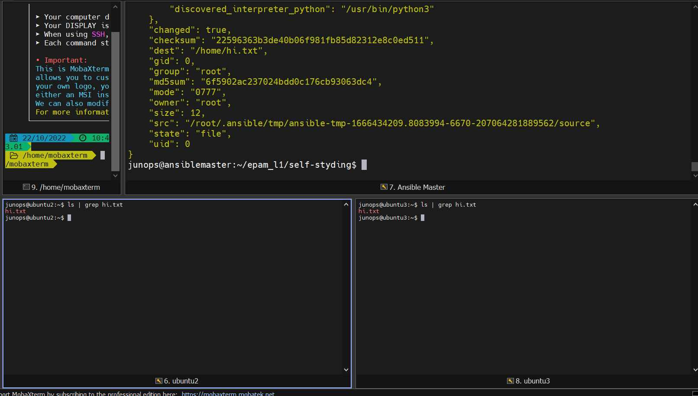

### Remove a file from servers
```
ansible all -m file -a "path=/home/junops/hi.txt state=absent" -b
```
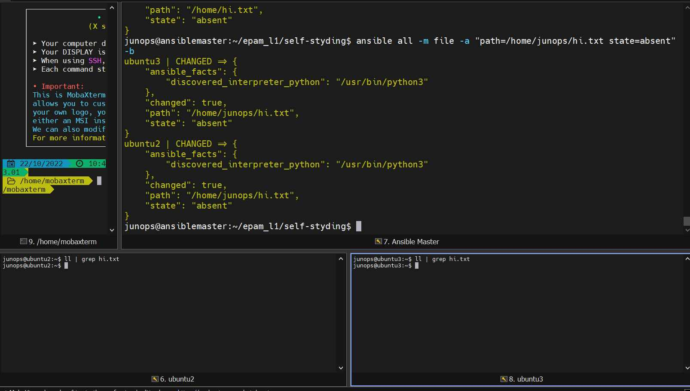

### Get URL
```
ansible all -m get_url -a "urll=https://fecton.github.io/aboutme dest=/home/junops/" -b
```
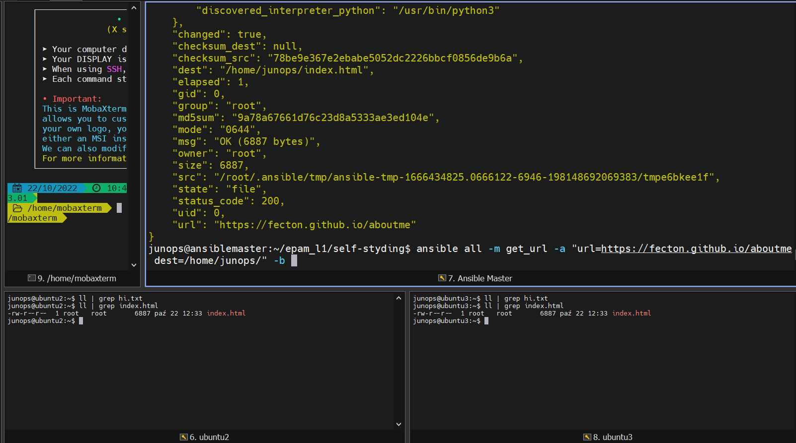

### Setup (Shows info)
```
ansible all -m setup
```
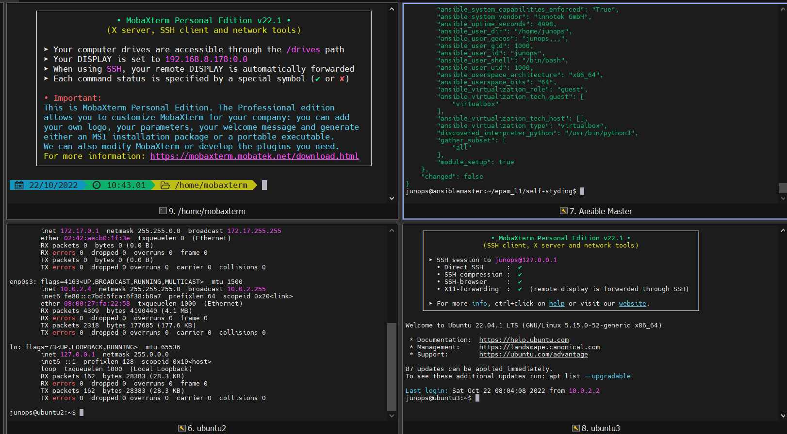

### APT install
```
ansible all -m apt "name=stress state=latest" -b
```
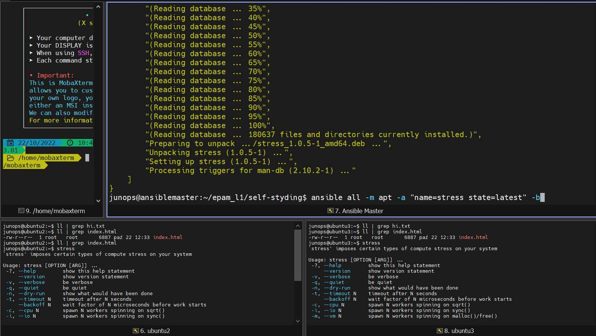

### APT remove
```
ansible all -m apt "name=stress state=remove" -b
```
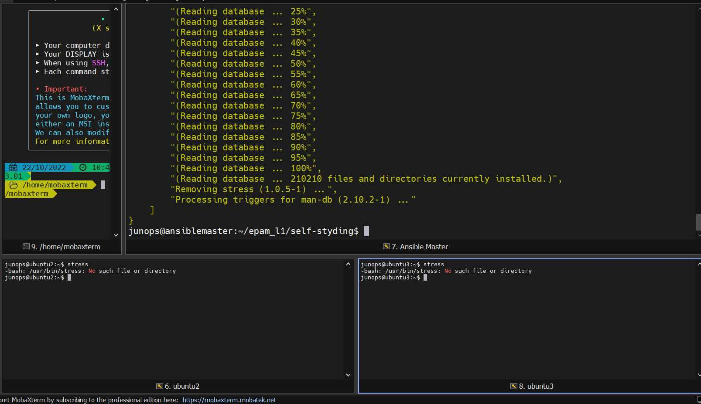

### Uri
```
ansible all -m uri "url=https://fecton.github.io/aboutme"
```
```
ansible all -m uri "https://fecton/github.io/aboutme return_content=yes"
```
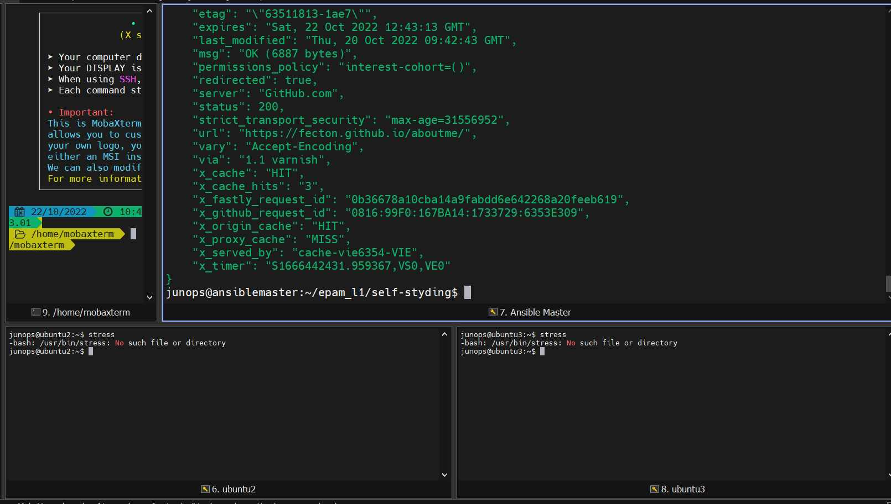

### Enable a service
```
ansible all -m service -a "name=sshd state=started enabled=yes" -b
```
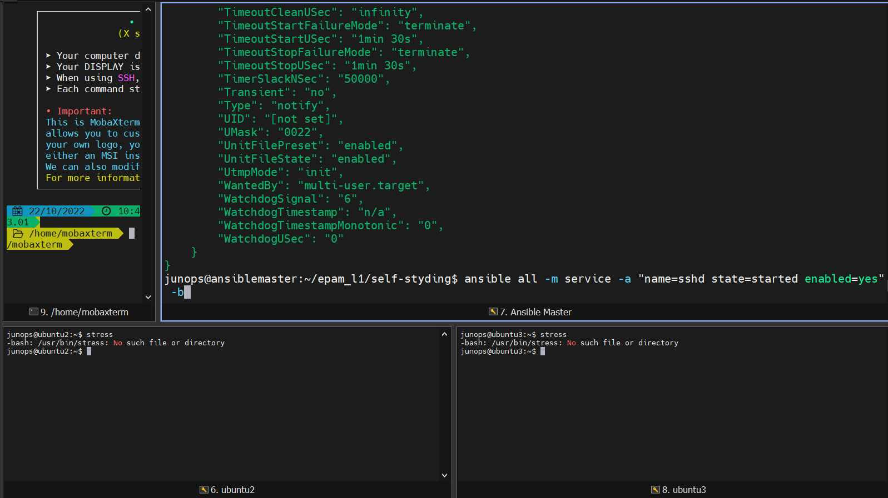

### Logs (additional info) (1-5)
```
ansible all -m shell -a "ls /home/junops" -v
ansible all -m shell -a "ls /home/junops" -vv
ansible all -m shell -a "ls /home/junops" -vvv
ansible all -m shell -a "ls /home/junops" -vvvv
ansible all -m shell -a "ls /home/junops" -vvvvv
```
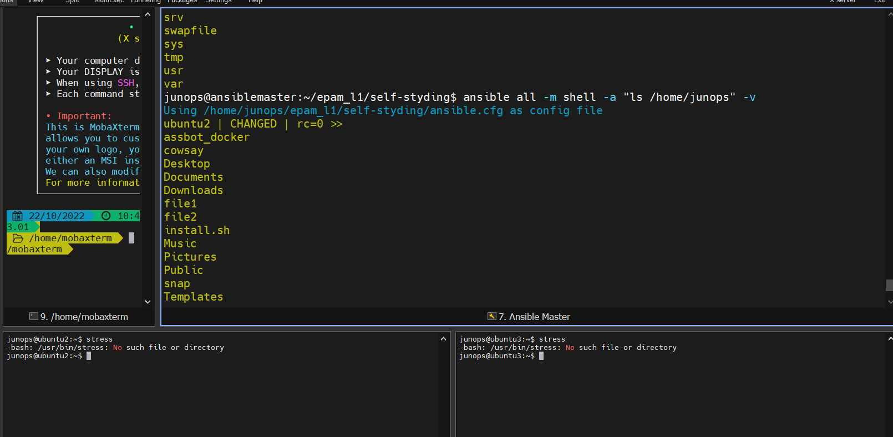
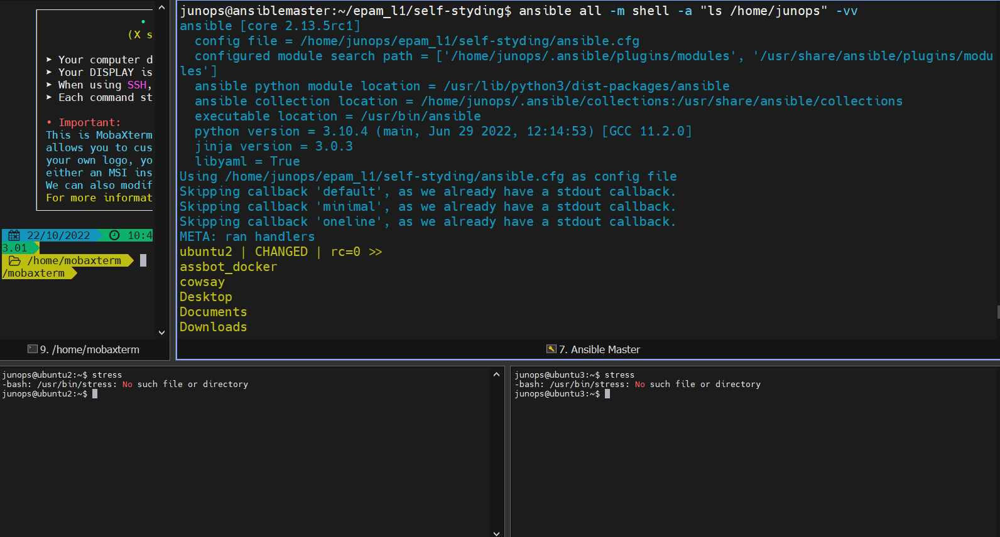
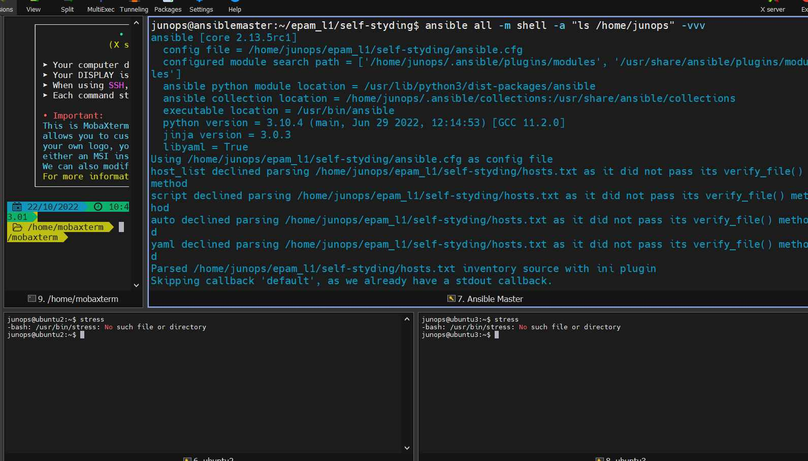

### Ansible doc
```
ansible-doc -l
```
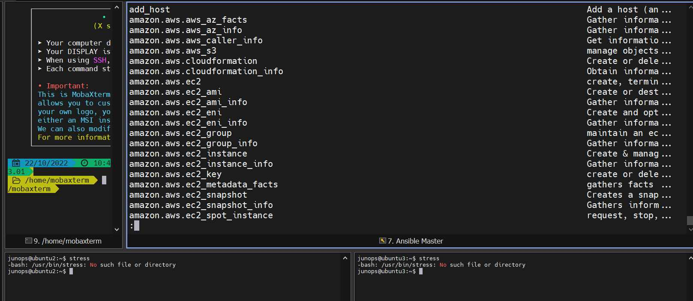