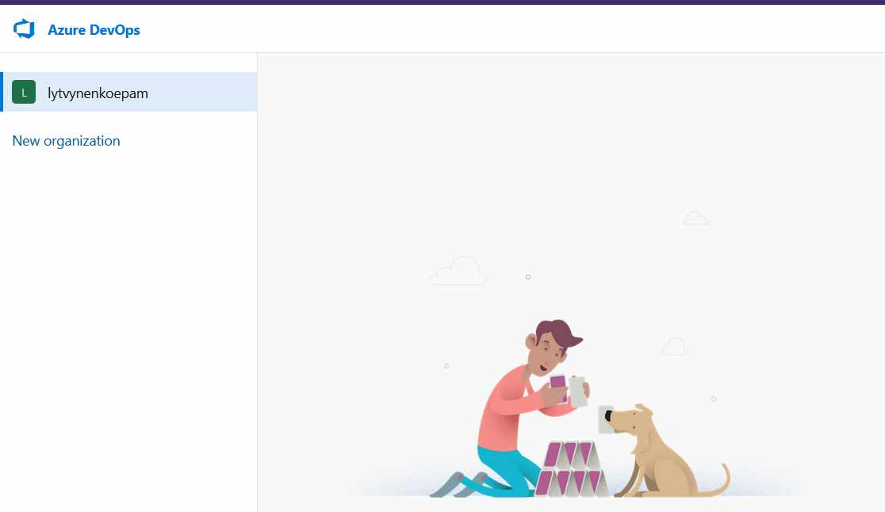

# Azure

## Prerequisites
### 1. Create azure subscription

### 2. Create azure devops organization

### 3. Read information about github flow branching strategy
### 4. Terraform should be installed

### 5. Terraform knowledged is also required to do the stuff
### 6. Az cli shoud be installed

# Homework
## PART 1
### 1. Create a service connection in a Azure DevOps project to your subscription 

### 2. Find a .net pet project for the experiments

