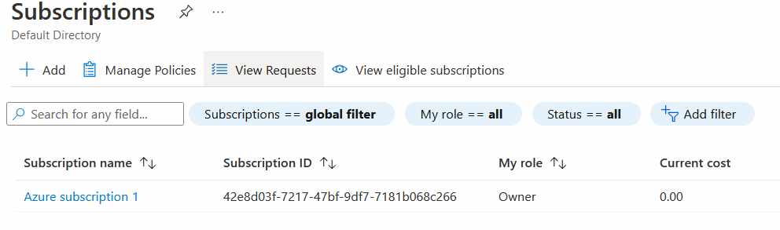
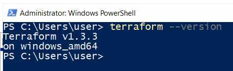
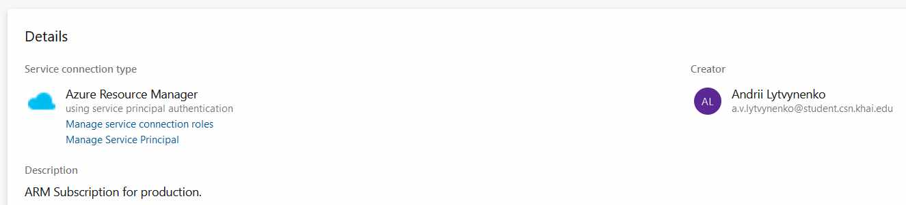

# Azure

## Prerequisites
### 1. Create azure subscription

### 2. Create azure devops organization

### 3. Read information about github flow branching strategy
### 4. Terraform should be installed

### 5. Terraform knowledged is also required to do the stuff
### 6. Az cli shoud be installed

# Homework
## PART 1

### 1. Create a service connection in a Azure DevOps project to your subscription 

### 2. Find a .net pet project for the experiments

## 3. Build your app locally .net project via dotnet tool. dotnet restore/build/runBuild you 

### 4.	Create an Azure DevOps repo - https://learn.microsoft.com/en-us/azure/devops/repos/git/create-new-repo?view=azure-devops  You can use import repository to import from existing source control version like github

