# Epam University
## Linux Networking

## Network map
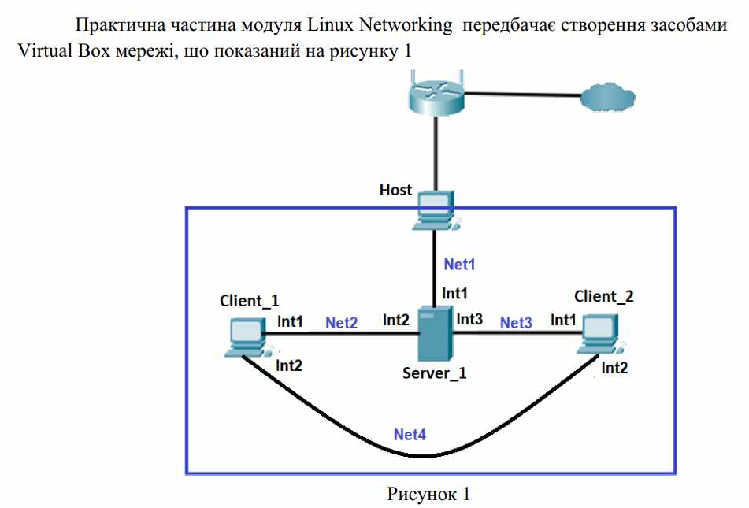
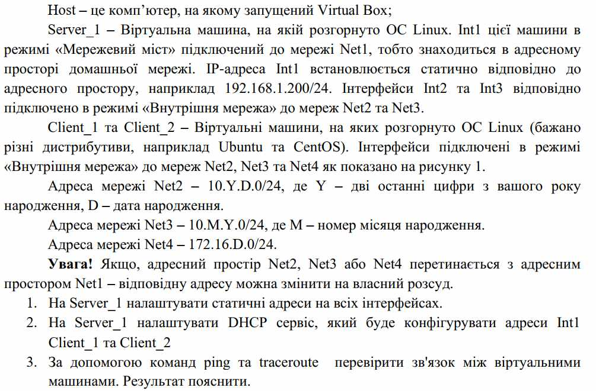
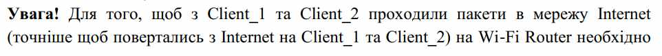

## 1. Створення мережі
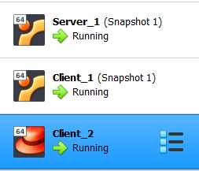
### Server1's adapters (Ubuntu)
- Adapter 1: NAT
- Adapter 2: Internal Network (Net2)
- Adapter 3: Internal Network (Net3)
### Client1's adapters (Ubuntu)
- Adapter 1: Internal Network (Net2)
- Adapter 2: Internal Network (Net4)
### Client2's adapters (Cent OS)
- Adapter 1: Internal Network (Net3)
- Adapter 2: Internal Network (Net4)

## Configure adapters
### Server1
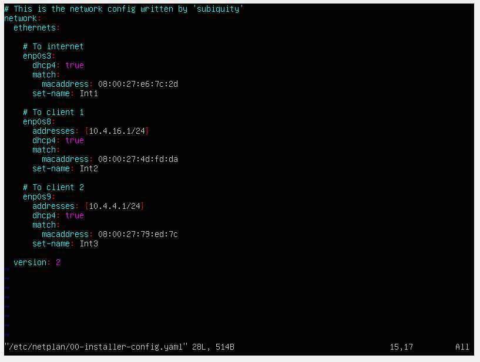

### Client1

### Client2
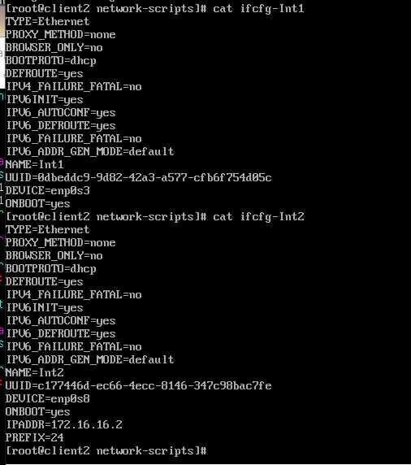

## Ping
### Server -> Client 1
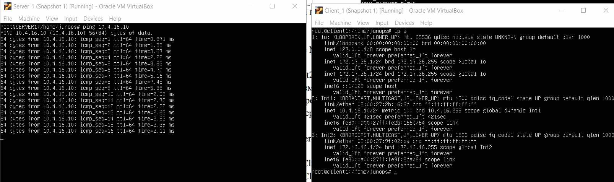
### Server -> Client 2
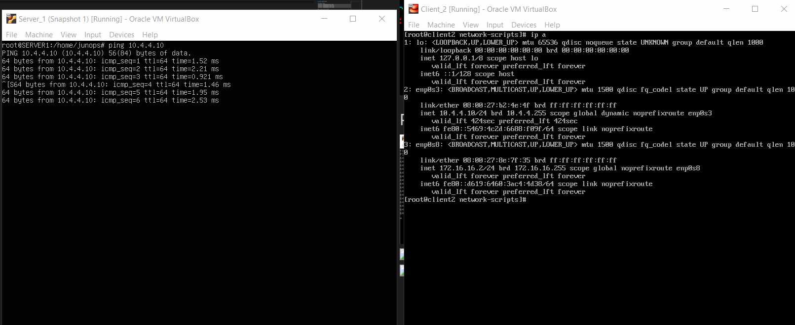
### Client 1 -> Server

### Client 2 -> Server
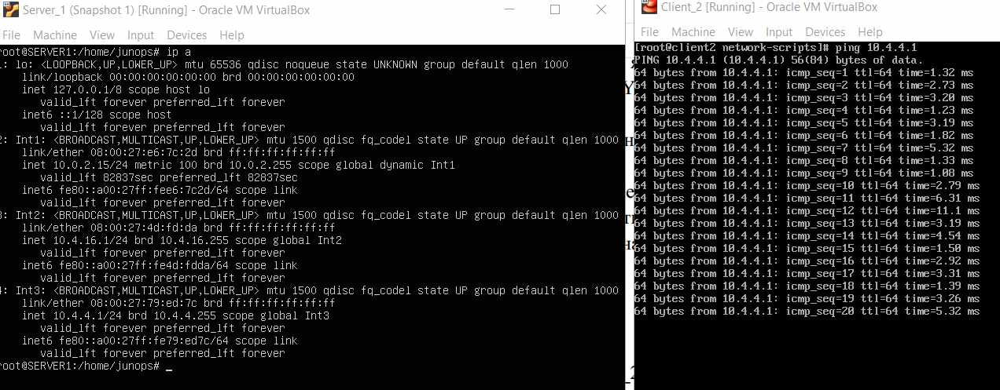

## (4) Routes

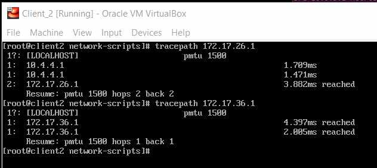

## (5) SSH and ping
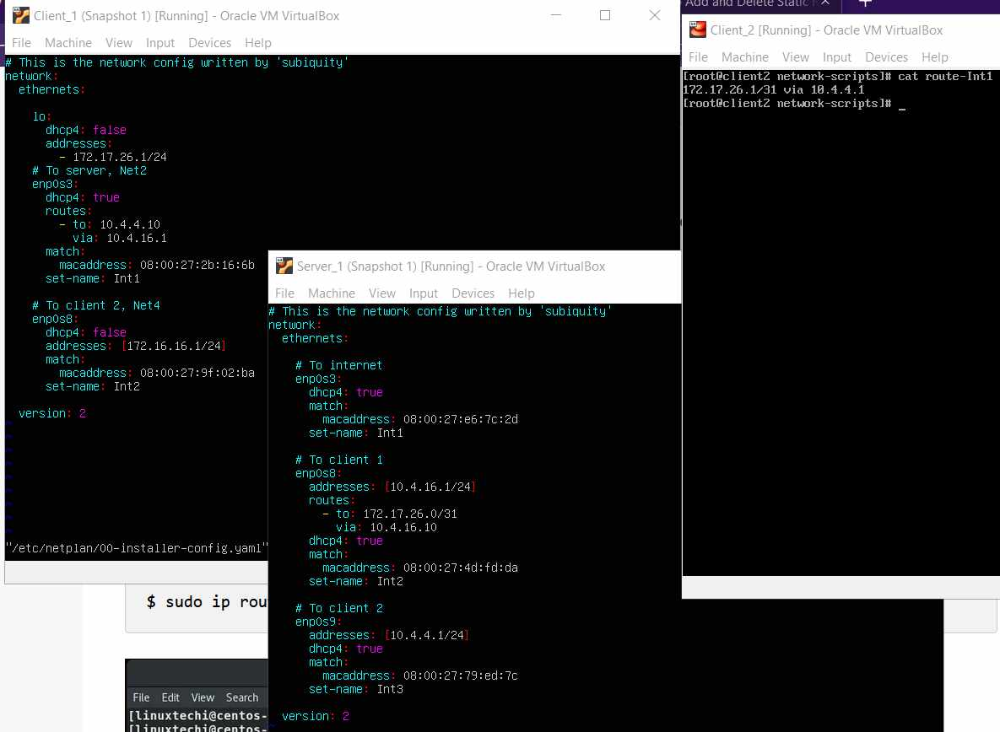

## Internet

